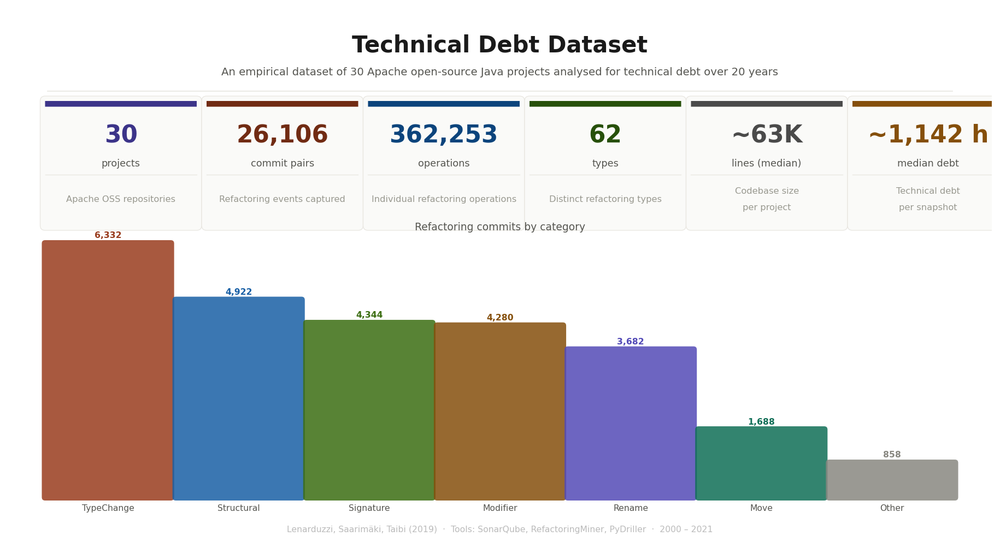
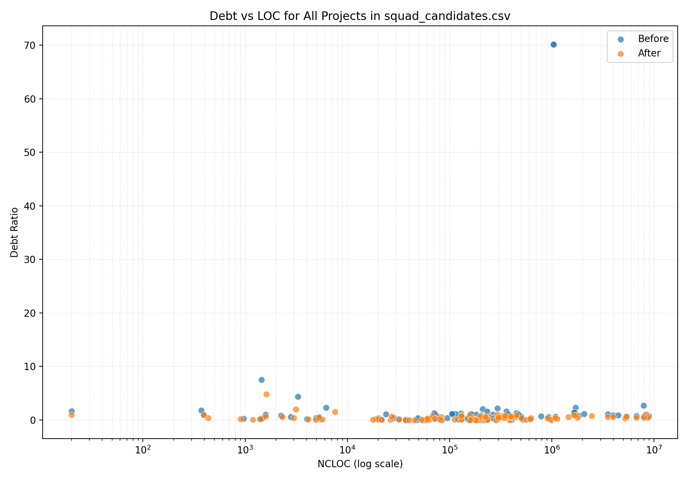
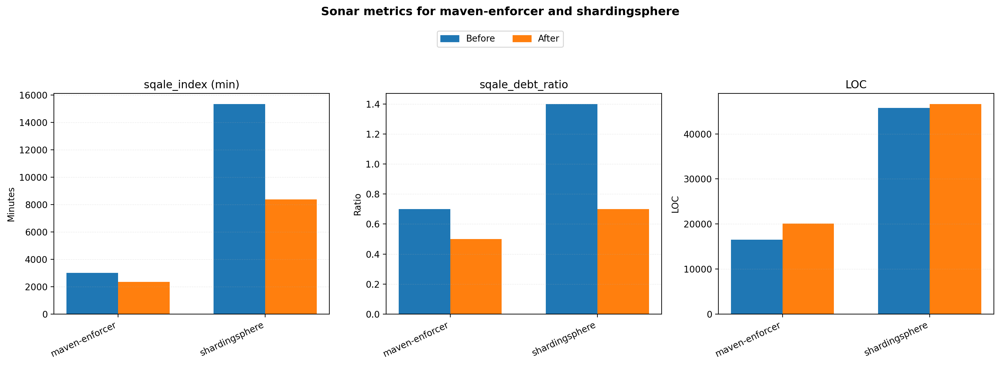
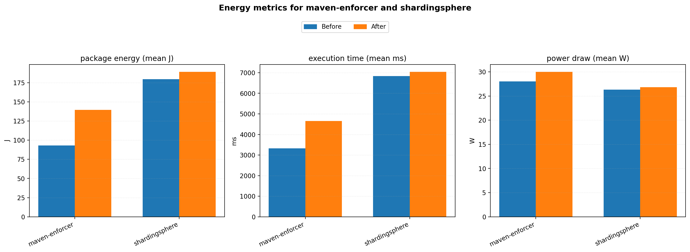

# Measuring Energy Debt

**Does reducing technical debt make software more energy‑efficient? Surprisingly, no.**

An empirical study investigating whether reducing technical debt lowers the energy
consumption of software. Refactoring candidates were mined from two large public
datasets (450+ projects evaluated), and the energy cost of "before vs. after"
versions was measured directly on Intel CPUs using **RAPL** hardware counters.

> 📄 Full write‑up: [**Measuring Energy debt_Grupo 14.pdf**](Measuring%20Energy%20debt_Grupo%2014.pdf)
>
> 🎓 Course project for **Project in Software Development, Validation and Evolution (PSDVM '26)**, University of Minho — graded **19/20**.

---

## Key finding

Contrary to expectations, **reducing technical debt did *not* reduce energy consumption.**

Two Apache Foundation projects were measured across **30 test‑suite executions each**.
Both showed *increased* energy use and execution time in their low‑debt versions,
despite debt reductions of **28–50%**. The results suggest technical debt and energy
consumption are **largely orthogonal** — code‑quality improvements should not be
assumed to also improve energy efficiency.

---

## How the study was done

The hard part wasn't measuring energy — it was **finding valid commit pairs**: two
versions of a real project where technical debt dropped substantially but the code
barely changed (so any energy difference can be attributed to the refactoring, not to
new features). Two datasets were mined to find them.

### 1. The Technical Debt Dataset (v2.0)
30 Apache Java projects analysed with SonarQube across their full git histories
(900k+ commits). Scripts here extract before/after refactoring pairs with full
SonarQube metrics, categorise them, and score them as energy‑study candidates.



### 2. The SonarQube Quality Dataset (SQuaD)
A second, larger dataset scanned in chunks to find project *releases* with real debt
drops and minimal lines‑of‑code change — the pipeline that produced the two projects
finally measured.



### 3. Energy measurement (RAPL)
For each selected version: a 30‑second idle baseline, then 30 executions of the test
suite, cooling the CPU back to within 3 °C of baseline between runs to avoid thermal
throttling. Energy was recorded as the delta of RAPL counters (package + core), with
execution time and CPU temperature logged alongside.

| SonarQube debt confirmed | Energy result |
|---|---|
|  |  |

---

## Repository layout

```
.
├── Measuring Energy debt_Grupo 14.pdf   # Full report (the deliverable)
├── dataset_summary.png                  # Technical Debt Dataset overview figure
│
├── Technical Debt Dataset pipeline (root)
│   ├── dump_schema.py         # Inspect the SQLite dataset (tables + sample rows)
│   ├── data_filterer.py       # Extract & score before/after refactoring pairs → CSVs
│   ├── data_analysis.py       # 12+ charts + combined report from the CSVs
│   ├── data_set_summary.py    # Renders the dataset_summary.png figure
│   ├── justify_selection.py   # Pick final commits (big debt drop, tiny LOC change)
│   └── output/                # Generated CSVs + charts
│
└── SQuaD/                     # SonarQube Quality Dataset pipeline
    ├── squad_stats.py            # Chunked scan: dataset-wide statistics
    ├── squad_explore.py          # Rank project-release pairs as candidates
    ├── squad_pipeline_prep.py    # Apply relaxed selection thresholds
    ├── count_dsv_lines.py        # Utility: count rows in the huge CSV
    ├── graphs.py                 # Result / candidate visualisations
    └── *.png, *.csv              # Generated outputs
```

## Getting the data

The two source datasets are large and are **not** committed to this repo
(see [`.gitignore`](.gitignore)):

- **Technical Debt Dataset v2.0** (`td_V2.db`, ~1.5 GB) — Lenarduzzi, Saarimäki &
  Taibi (2019). Download from the [official release](https://github.com/clowee/The-Technical-Debt-Dataset).
- **SQuaD** (`squad.csv`) — the SonarQube Quality Dataset raw export.

Place `td_V2.db` in the project root and `squad.csv` in `SQuaD/`.

## Running it

```bash
pip install -r requirements.txt

# ── Technical Debt Dataset pipeline ──
python dump_schema.py     --db td_V2.db          # peek at the schema
python data_filterer.py   --db td_V2.db --out ./output   # extract scored pairs
python data_analysis.py   --dir ./output         # generate charts
python justify_selection.py --dir ./output       # pick final candidate commits

# ── SQuaD pipeline ──
python SQuaD/squad_stats.py        squad.csv
python SQuaD/squad_explore.py      squad.csv     # → squad_candidates.csv
python SQuaD/squad_pipeline_prep.py squad_candidates.csv
python SQuaD/graphs.py                            # render result figures
```

Energy measurement itself was performed on Linux with Intel RAPL; this repository
contains the candidate‑selection pipelines, the recorded results, and the analysis.

---

## Author

**Hugo Simões Marques** — University of Minho, Braga, Portugal
Project in Software Development, Validation and Evolution (PSDVM '26).

## References

- V. Lenarduzzi, N. Saarimäki, D. Taibi. *The Technical Debt Dataset.* PROMISE, 2019.
- R. Couto et al. — the concept of *energy debt*.
- Tools used: SonarQube, RefactoringMiner, PyDriller, Intel RAPL.
